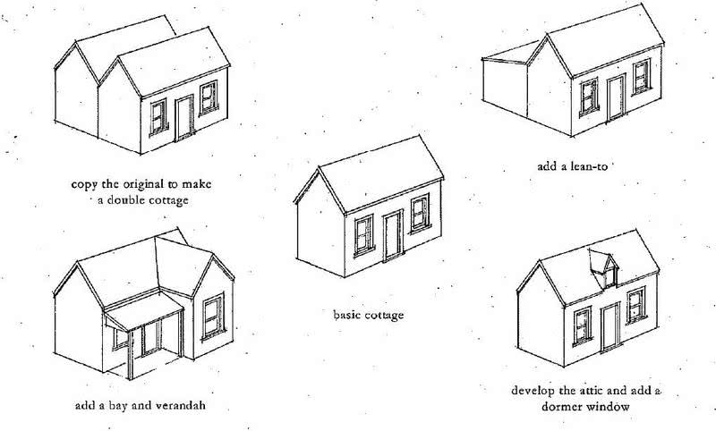
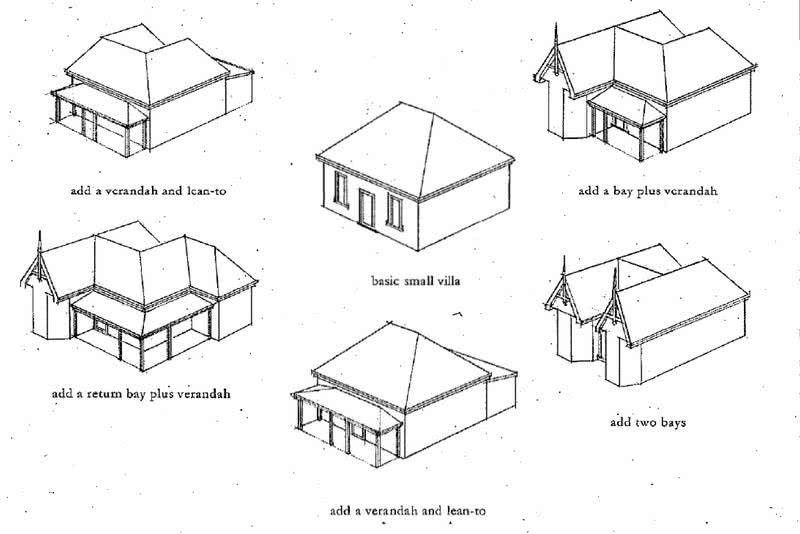
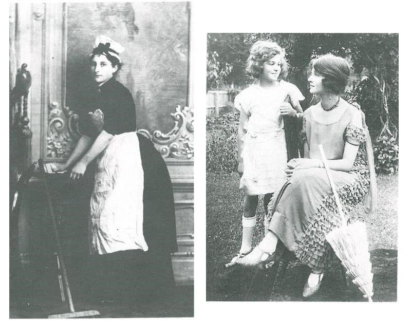
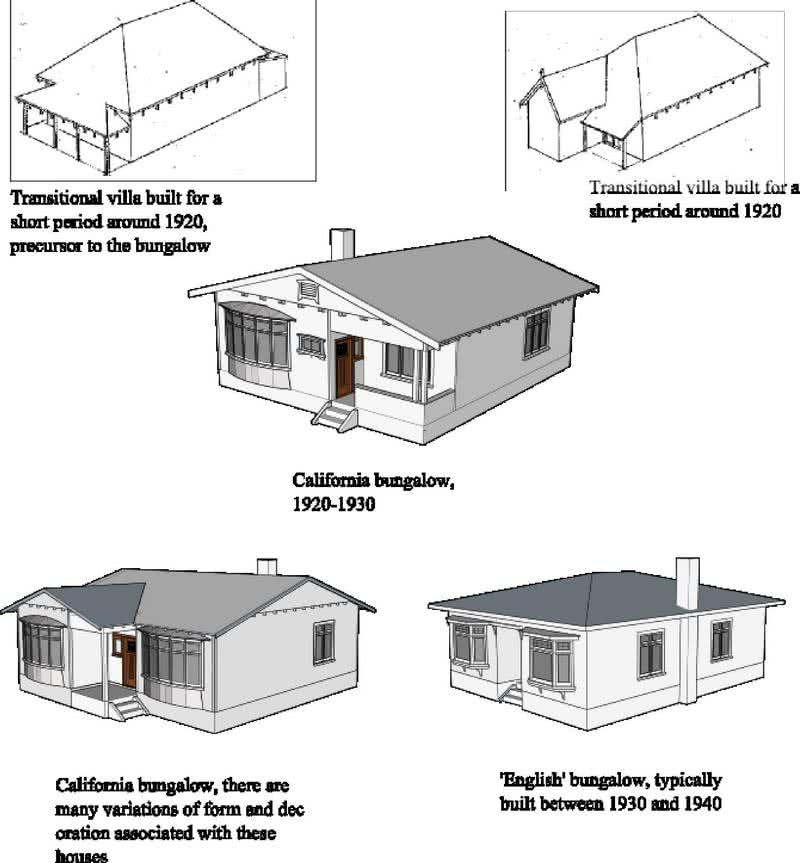
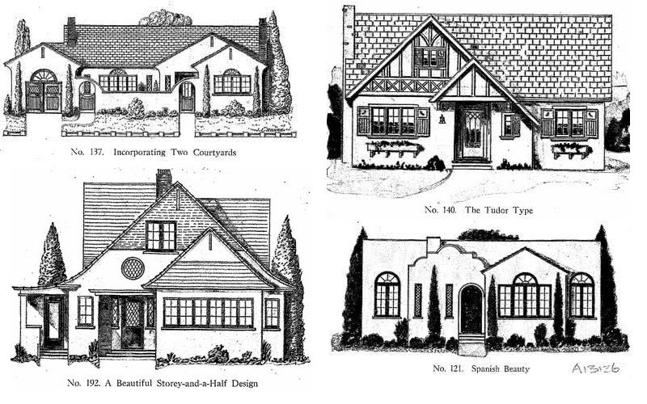
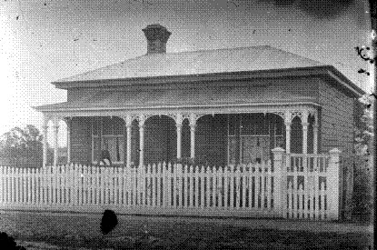
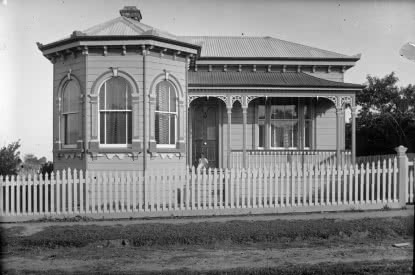

## Introduction
This long form article is about Auckland houses, built prior to the Second World War, written in the hope that it will be useful with for those with an interest in heritage, street character, and family history. Generally it is not necessary to know the exact year a house was built, and finding this out with certitude is often difficult, given the state of the available archives.For most people it will be sufficient to know the decade of construction.

One way of determining the approximate age of a house is through examining the physical evidence, the form and detail of the house. In order to do this it is useful to have a conceptual framework and a context in which to place what one is seeing.

## Nineteenth century
During the nineteenth century society in New Zealand was hierarchical, colonial and homogenous in comparison with society today. People were more free to move between classes in the social hierarchy than they had been in the British Isles, but the hierarchy continued to exist. Different types of housing were built to reflect these differences in social class.

Grand houses were built for successful farmers and merchants. These tended to be designed by architects, and referenced modes of design current in England and America. Dating these houses based on detail is difficult, and is probably best left to specialists in the field. Therefore this type will not be included in this self help document, at this stage.

## Cottages
Houses for working people were simple boxes, often gable roofed, and related to the Georgian derived colonial cottages found in the Australia penal colonies. Pattern books and standard plans were often used as a starting point.

As economic conditions in the nascent towns improved, (due to technological advances, increasing population, and the availability of capital, often linked to the discovery of gold) these simple cottages became larger. The earlier houses were either demolished or added to, as money became available. Thus a simple 2 room cottage could become a 4 room cottage, and then lean-tos and bays could be added.

*Cottage houses with double hung windows. These were built prior to 1915.

From the 1860's on industries involved in the manufacture of woodware were started, first in Dunedin, and then in Auckland. Locally manufactured joinery and machine made wooden decoration began to be available. This decoration referenced a variety of styles, Gothic and Italianate, and its application was viewed as an index of the status and material success of the home owner.

There was rarely involvement of either architects or draughts people in the design of these small colonial houses. Design decisions were made by the owner, and the carpenter, and consisted of the variation of standard plans, and the dressing up of these simple forms with woodware decoration, selected from catalogues.

Roof form is important in these houses. Simple gable or hip forms with short rafter spans were preferred. Rafter sizes never went above 2" x 4" and corrugated steel sheets came in short lengths. Therefore two room cottages had a simple gable roof. Four room cottages sometimes consisted of two gable roofs side by side, as is seen at the Engineers house at the Western Springs pump station (now Motat). However it was more common to use hipped roofs and a centre gutter arrangement, as this proved to be very flexible as further rooms and projected bays were added.

*Evolution of cottage to villa: – roof forms

The evolution from cottage to villa took place in the 1870's and 1880's, and all forms of these houses continued to be built up until the First World War. Indeed the two room house continued to be built as tramping and bach accommodation until quite recently.

*Villa houses. These were built prior to 1915. Detail and decoration is also a good indicator of age. Nigel Isaacs has provided a very good summary at [Branz renovate](href="http://renovate.org.nz/villa/)

## After the First World War

Following the First World War houses of the bay villa or transitional type ceased to be built in Auckland. Prior to the war the bungalow had been an architect’s style, related to the Arts and Crafts movement, and with influences from either England or America.

The First World War caused a rupture in the fabric of New Zealand society, and the loss of a very large number of young men was felt for decades. After the war people were looking for new and informal ways of living and domestic servants for the middle and upper classes became less common.

*Servant cleaning house, 19th century houses were labour intensive, and difficult to clean and cook in. After the First Wold War modes of dress and relationships between people, both within families and in society were different from how they had been in the Victorian and Edwardian periods.

## Bungalows

The various post war bungalow styles as developed in New Zealand were a response to this context. The style very quickly became the strict domain of draughts people rather than architects, who referred to plan books which were often American. The approach was often similar to that used in choosing woodware decoration for villas. In  decorating villas the carpenter and owner, would together refer to catalogues  and choose various items for addition to the facade.

With the use of the bungalow style for middle and lower income housing, draughts people became necessary, as the style was new, and houses were more complex. Advances in technology meant that there were more services to be integrated into the house. Thus the owner would consult plan books and come to the draughts person with pictures of facade styling that appealed. These would then be grafted on to a standard plan by the draughts person. The central hallway plan found in the bay villa remained as an option throughout the period, and there was a variation with less hallway and an entrance from the side of the house. Typically orientation to the sun and available views was not a great factor in designing these houses. 

*Further information on bungalow detail can be found at [Branz renovate](href="http://renovate.org.nz/villa/)

## Bungalow style

Available styles included: -

1. The Californian:- gabled roof, pylons, scalloped barge boards, exposed rafters, shingles – usually dates from the 1920’s, none built after 1944
1. The English:- hipped roof, inglenook, lots of leaded and facetted glass, generally slightly later than the Californian, sometimes built after  1944.
1. Colonial and Georgian revival:-	again initially an architects style in New Zealand (e.g. CR Ford’s housing work), hipped roof, simple symmetrical form, windows with divided lights, again sometimes built after 1944.
1. And others. As with the decoration of villas stylistic elements from several categories could be present in the one house, and variations of bungalow planning could also be used for even more exotic adventures in styling such as small suburban castles, Spanish mission and moderne or streamlined. This eclectic approach to housing design became common after 1930.

*Elevations from J.L. Hanna’s 1931 pattern book “Modern New Zealand Homes”

## Outliers, complexities
This discussion is very simplified. Other explanations of how the traditional New Zealand house evolved exist, and relate to the trickle down of influence from the work of celebrated architects to inform the design of houses lower in the social hierarchy, rather than the slow, vernacular development described above.

Another complexity is to do with the alteration of houses. Many villas were restyled during the bungalow period, and many cottages were made much grander as money became available. A further issue is the modern practice of building replica villas. Because the construction of these is recent most owners are aware of the history of these houses.

*The Binns family home at 13 Francis Street as originally built, around 1908. Auckland Public Library 80-BIN 47.

*The Binns family home with bay window added, 1912. This house is still on this site. Auckland Public Library 80- BIN 163

## In conclusion
Villas, cottages and Californian bungalows have construction dates prior to 1944. English bungalows and Art Deco houses will usually be constructed prior to 1944, but not always. Archival evidence such as land and valuation records, early aerial photo’s and building consent records can be consulted if necessary.

